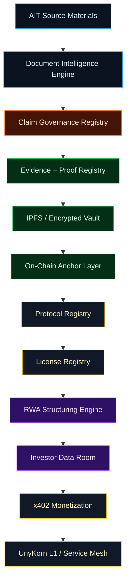
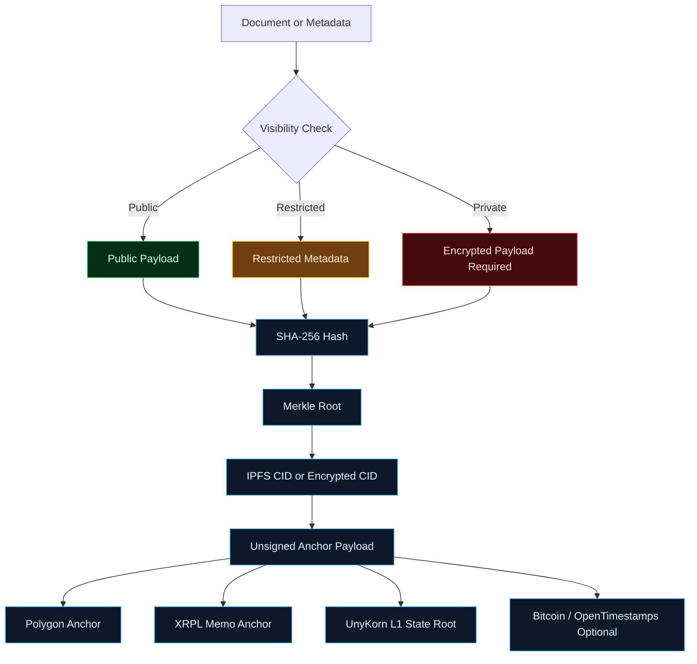
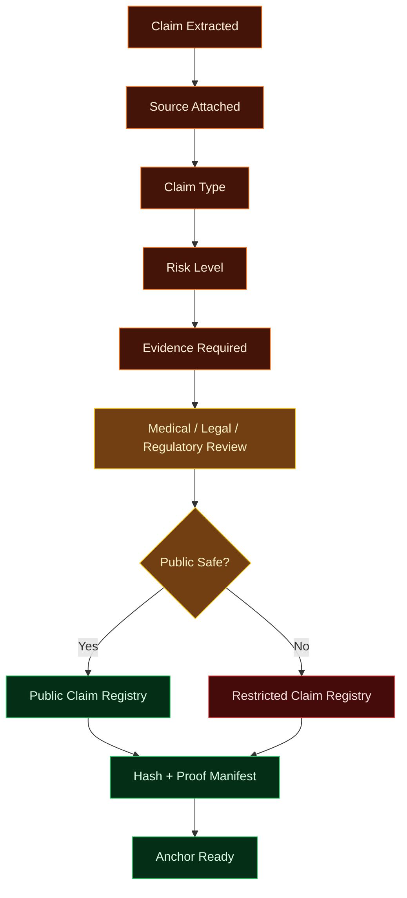
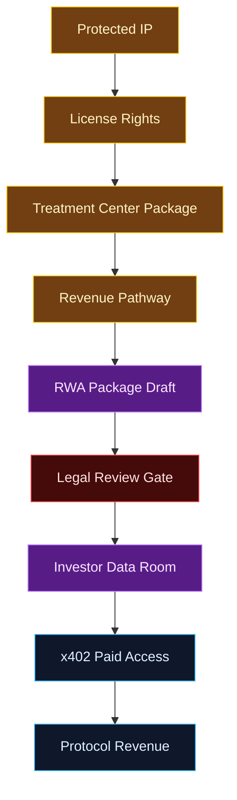
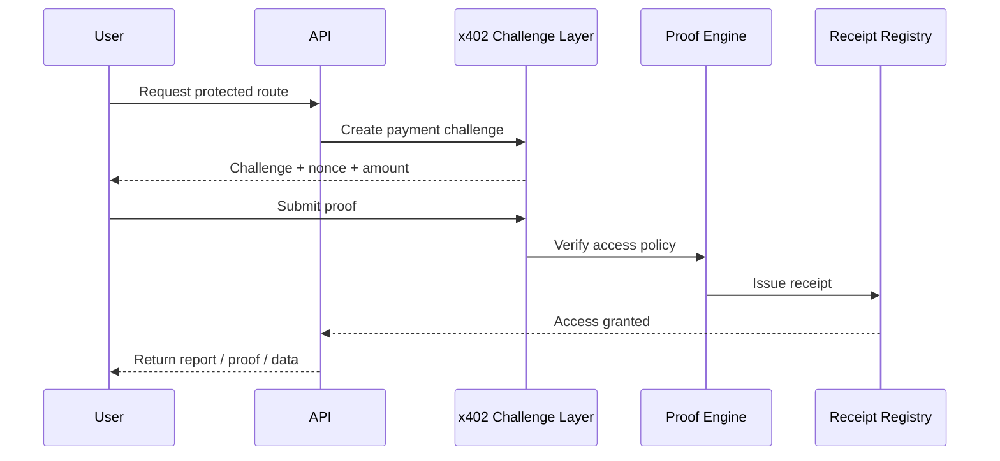
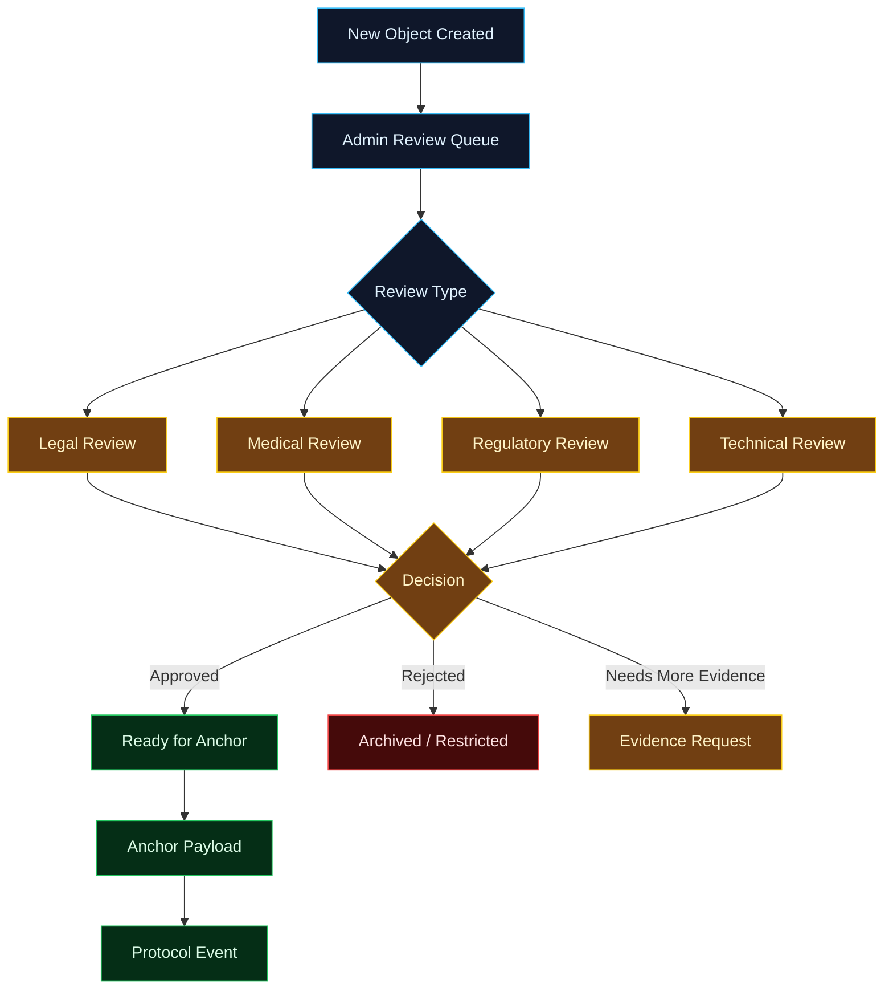

# AIT Biofield OS

> **Evidence, licensing, protocol, and RWA infrastructure for Autologous Infusion Technologies and Therapies.**


---

## Overview

**AIT Biofield OS** is the AIT-specific infrastructure layer inside this monorepo. It organizes, protects, verifies, licenses, and monetizes AIT-related technology, documents, claims, rights, and deployment pathways through the `apps/web` Next.js surface and typed backend engines under `apps/web/src/lib/ait`.

The system does **not** provide medical treatment.
It provides the **digital infrastructure layer** around the technology:

- Document proof
- IP protection
- Claim governance
- Evidence registry
- Protocol module registration
- RWA structuring
- Treatment center readiness
- Investor data room
- x402 paid-access infrastructure
- UnyKorn L1 / Service Mesh integration

---

## Launch Status

- Phase 1-3 core infrastructure implemented (proof, claim, RWA, x402, anchors, admin workflow).
- Phase 4 hardening artifacts added for launch, investor, security, and deployment readiness.
- Voice Intelligence Layer added for public-safe route narration and demo walkthroughs.
- `apps/web` production build currently passes with Next.js.
- Private-vault and legal/medical/regulatory gates remain enforced in docs and route behavior.

## Current Implemented Surfaces

- AIT route tree under `apps/web/src/app/ait` and admin surfaces under `apps/web/src/app/admin/ait`.
- AIT brand and media surfaces under `/ait/media`, `/ait/videos`, `/ait/brand`, and `/ait/voice`.
- Typed proof/claim/RWA/x402 engines under `apps/web/src/lib/ait/engine.ts`.
- Durable repository abstraction with file fallback and Prisma-ready adapter under `apps/web/src/lib/ait/repository.ts`.
- Session-based admin auth and role checks under `apps/web/src/lib/ait/access.ts`.
- Review queue UI with action posting and role-gated mutation enforcement.
- Demo-safe pages under `/demo/*` and synthetic datasets under `examples/`.

## Voice Intelligence Layer

- Browser TTS-first architecture using Web Speech API.
- Route narration registry under `apps/web/src/data/ait/voiceNarrations.ts`.
- Safety guardrails under `apps/web/src/lib/voice/safety.ts`.
- Voice endpoints under `apps/web/src/app/api/voice/*`.
- Admin voice summary panels are disabled unless `AIT_VOICE_ALLOW_ADMIN=true`.
- External voice providers are disabled by default and are env-gated.

Default voice env values:

```bash
AIT_VOICE_ENABLED=true
AIT_VOICE_PROVIDER=browser
AIT_VOICE_EXTERNAL_ENABLED=false
AIT_VOICE_ALLOW_ADMIN=false
```

## GitHub Publishing

- Publish checklist: [docs/github-publish.md](docs/github-publish.md)

## Demo-Safe Boundaries

- Demo assets and sample payloads are synthetic and non-identifying.
- No KYC, no patient records, no raw formula/dosing content, no confidential investor files.
- No live token-sale logic and no unsupported medical claims.
- Offering-related narratives remain legal-review gated.

## Phase 4 Readiness Guides

- [docs/overview/launch-checklist.md](docs/overview/launch-checklist.md)
- [docs/rwa/investor-readiness-checklist.md](docs/rwa/investor-readiness-checklist.md)
- [docs/compliance/security-hardening-checklist.md](docs/compliance/security-hardening-checklist.md)
- [docs/protocol/deployment-notes.md](docs/protocol/deployment-notes.md)
- [docs/overview/voice-intelligence-layer.md](docs/overview/voice-intelligence-layer.md)
- [docs/compliance/voice-safety-policy.md](docs/compliance/voice-safety-policy.md)
- [docs/overview/video-voice-scripts.md](docs/overview/video-voice-scripts.md)
- [examples/demo-safe-dataset.json](examples/demo-safe-dataset.json)

---

## Table of Contents

1. [System Thesis](#system-thesis)
2. [Core Categories](#core-categories)
3. [Launch Status](#launch-status)
4. [Current Implemented Surfaces](#current-implemented-surfaces)
5. [GitHub Publishing](#github-publishing)
6. [Demo-Safe Boundaries](#demo-safe-boundaries)
7. [Phase 4 Readiness Guides](#phase-4-readiness-guides)
8. [Voice Intelligence Layer](#voice-intelligence-layer)
9. [System Architecture](#system-architecture)
10. [AIT Protocol Stack](#ait-protocol-stack)
11. [Proof + IPFS Flow](#proof--ipfs-flow)
12. [Claim Governance Flow](#claim-governance-flow)
13. [RWA + Monetization Flow](#rwa--monetization-flow)
14. [Agentic RAG Layer](#agentic-rag-layer)
15. [x402 Monetization Layer](#x402-monetization-layer)
16. [Repository Structure](#repository-structure)
17. [API Surface](#api-surface)
18. [Admin + Review Workflow](#admin--review-workflow)
19. [Compliance Boundaries](#compliance-boundaries)
20. [Roadmap](#roadmap)
21. [Security Policy](#security-policy)
22. [Contributing](#contributing)

---

## System Thesis

AIT brings the therapeutic technology and source materials.

UnyKorn brings the infrastructure that makes the system:

- **Protectable**
- **Provable**
- **Governable**
- **Licensable**
- **Financeable**
- **Monetizable**
- **Protocolized**

```text
AIT Technology
→ IP Protection
→ Document Proof
→ Claim Governance
→ Protocol Registry
→ RWA Structuring
→ x402 Monetization
→ UnyKorn L1 / Service Mesh
```

---

## Core Categories

| Color | Category | Purpose |
| ----- | -------- | ------- |
| 🟦 Blue | Protocol / Service Mesh | Routes data, schemas, modules, and events |
| 🟨 Gold | IP / Licensing | Protects formulas, rights, territories, and licenses |
| 🟩 Green | Evidence / Proof | Hashes, Merkle roots, IPFS, anchor payloads |
| 🟧 Orange | Claims / Compliance | Reviews medical, technical, financial, and regulatory claims |
| 🟪 Purple | RWA / Capital | Structures IP rights, license rights, revenue rights, and SPV pathways |
| 🟥 Red | Restricted / Private | KYC, formulas, patient data, raw confidential documents |
| ⬛ Black | Sovereign Infrastructure | L1, service mesh, identity, payments, agents, and governance |

---

## System Architecture



---

## AIT Protocol Stack


---

## Proof + IPFS Flow

The AIT proof system is designed to prove existence, versioning, document integrity, and review status without exposing confidential data.



---

## Claim Governance Flow

Every medical, technical, financial, operational, and regulatory claim must be classified before it becomes public-facing.



---

## RWA + Monetization Flow

The system does **not** tokenize medical promises.

It structures documented rights and infrastructure pathways:

- IP license rights
- Protocol usage rights
- Treatment center packages
- Equipment / retrofit packages
- Revenue participation rights, subject to legal review
- SPV-ready documentation
- Investor data room access



---

## Agentic RAG Layer

The Agentic RAG layer turns documents into structured protocol objects.

| Agent | Function |
| ----- | -------- |
| Document Intelligence Agent | Extracts claims, sections, tables, summaries, and document metadata |
| Claim Classification Agent | Classifies risk, claim type, evidence required, and public-safety status |
| IP Protection Agent | Separates public, restricted, private, and trade-secret materials |
| RWA Structuring Agent | Maps license rights, revenue rights, and SPV-ready objects |
| Protocol Schema Agent | Generates schemas, event types, and registry objects |
| Compliance Agent | Flags legal, medical, financial, and regulatory review gates |
| Anchor Agent | Prepares hash, Merkle, IPFS, and chain payloads |
| x402 Agent | Meters paid routes, reports, receipts, and access packages |

---

## x402 Monetization Layer

x402 enables paid access to proof, reports, APIs, and data-room functions.



Paid-access examples:

| Route | Monetization Use |
| ----- | ---------------- |
| `/api/ait/documents/hash` | Generate proof manifest |
| `/api/anchors/merkle` | Create Merkle proof |
| `/api/ait/claims/classify` | Claim review matrix |
| `/api/ait/rwa/packages` | RWA package generator |
| `/api/x402/challenge` | Paid challenge object |
| `/api/x402/receipt` | Receipt and access record |
| `/api/anchors/verify` | Verify anchor proof |

---

## Repository Structure

```text
biofield/
├── README.md
├── LICENSE
├── SECURITY.md
├── CONTRIBUTING.md
├── .gitignore
├── docs/
│   ├── ait-biofield/
│   ├── overview/
│   ├── protocol/
│   ├── ip/
│   ├── claims/
│   ├── proof/
│   ├── rwa/
│   ├── x402/
│   └── compliance/
├── apps/
│   └── web/
│       └── src/
│           ├── app/
│           │   ├── ait/
│           │   ├── protocol/
│           │   ├── l1/
│           │   ├── mesh/
│           │   ├── agents/
│           │   ├── developers/
│           │   ├── admin/
│           │   └── api/
│           ├── data/
│           └── lib/
│               └── ait/
│                   ├── access.ts
│                   ├── admin.ts
│                   ├── engine.ts
│                   ├── repository.ts
│                   ├── types.ts
│                   └── workflows.ts
├── examples/
│   ├── proof-manifest.example.json
│   ├── claim-review.example.json
│   ├── rwa-package.example.json
│   ├── x402-challenge.example.json
│   └── anchor-payload.example.json
├── packages/
├── services/
└── tests/
```

---

## API Surface

### Document + Proof

| Endpoint | Purpose |
| -------- | ------- |
| `POST /api/ait/documents/hash` | Generate document hash and proof manifest |
| `POST /api/anchors/merkle` | Build deterministic Merkle root |
| `POST /api/anchors/ipfs` | Prepare public or encrypted IPFS payload |
| `POST /api/anchors/verify` | Verify hash, Merkle, CID, or anchor metadata |

### Chain Anchors

| Endpoint | Purpose |
| -------- | ------- |
| `POST /api/anchors/polygon` | Generate unsigned Polygon anchor payload |
| `POST /api/anchors/xrpl` | Generate unsigned XRPL memo anchor payload |
| `POST /api/anchors/unykorn` | Generate UnyKorn L1 state-root anchor payload |

### Claims

| Endpoint | Purpose |
| -------- | ------- |
| `POST /api/ait/claims/classify` | Classify claim type, risk, and evidence requirements |
| `POST /api/ait/claims/review` | Create review object |
| `POST /api/ait/claims/evidence` | Generate evidence checklist |

### RWA

| Endpoint | Purpose |
| -------- | ------- |
| `POST /api/ait/rwa/packages` | Generate RWA package metadata |
| `POST /api/ait/rwa/waterfall` | Generate waterfall model |

### x402

| Endpoint | Purpose |
| -------- | ------- |
| `POST /api/x402/challenge` | Create payment challenge |
| `POST /api/x402/verify` | Verify proof |
| `POST /api/x402/receipt` | Issue receipt |
| `POST /api/x402/meter` | Meter paid usage |

### Admin

| Endpoint | Purpose |
| -------- | ------- |
| `GET /api/admin/ait/reviews` | List durable admin review records |
| `POST /api/admin/ait/reviews/create` | Create admin review item |
| `POST /api/admin/ait/reviews/update` | Update review status or notes |
| `GET /api/admin/ait/documents` | List document proof and persistence records |
| `GET /api/admin/ait/claims` | List claim reviews and evidence requests |
| `GET /api/admin/ait/rwa` | List persisted RWA package records |
| `GET /api/admin/ait/anchors` | List Merkle, IPFS, and anchor payload records |
| `GET /api/admin/ait/x402` | List x402 challenge and receipt records |

---

## Admin + Review Workflow



Review statuses:

```text
PENDING_REVIEW
APPROVED
REJECTED
NEEDS_LEGAL_REVIEW
NEEDS_MEDICAL_REVIEW
NEEDS_REGULATORY_REVIEW
READY_FOR_ANCHOR
ANCHORED
ARCHIVED
```

---

## Compliance Boundaries

This repository is for infrastructure, documentation, proof, licensing, protocol, and diligence workflows.

It is **not**:

- Medical advice
- Clinical validation
- FDA clearance
- Securities offering
- Public token sale
- Patient record system
- Replacement for legal, medical, regulatory, or securities counsel

Restricted data must never be committed to this repository.

Never commit:

```text
raw formulas
exact ratios
dosing details
private KYC
passport / SSN / driver's license data
patient data
raw medical records
private contracts
bank documents
unfiled patent materials
confidential investor documents
```

---

## Roadmap

### Phase 1 — Foundation

- [x] System overview
- [x] Route scaffold
- [x] Document hash endpoint
- [x] Proof manifest model
- [x] Claim classification model
- [x] RWA package model
- [x] x402 challenge scaffold

### Phase 2 — Durable State

- [x] Persist proof manifests
- [x] Persist claim reviews
- [x] Persist RWA packages
- [x] Persist x402 receipts
- [x] Admin review queue
- [x] Role-gated write access

### Phase 3 — Proof Infrastructure

- [x] Merkle batch registry
- [ ] IPFS adapter
- [ ] Encrypted payload vault
- [ ] Polygon anchor signing
- [ ] XRPL memo anchor broadcast
- [ ] UnyKorn L1 event sync

### Phase 4 — Monetization

- [ ] x402 real proof verification
- [ ] Metered API access tiers
- [ ] Data room access tiers
- [ ] Report generation
- [ ] Paid RWA package generation

### Phase 5 — Protocol Expansion

- [ ] AIT module registry
- [ ] L1 service mesh sync
- [ ] Agentic RAG ingestion
- [ ] Developer SDK
- [ ] Governance workflow
- [ ] External partner portal

---

## Security Policy

All private documents, KYC, formula materials, medical records, and confidential contracts must remain outside the public repository.

Use:

- Encrypted storage
- Private vaults
- Hash-only public proof
- Access-controlled data rooms
- NDA-gated review
- Role-based permissions

See [SECURITY.md](SECURITY.md).

---

## Contributing

This repository is currently controlled by **FTHTrading**.

Contributions should follow:

1. No confidential data in commits
2. No unsupported medical claims
3. No live securities/token-sale code
4. No private keys or secrets
5. Every protocol object should be typed, reviewed, and testable

See [CONTRIBUTING.md](CONTRIBUTING.md).

---

## License

Private / restricted repository license unless otherwise stated.

Infrastructure components may later be separated into open-source modules after legal review.
